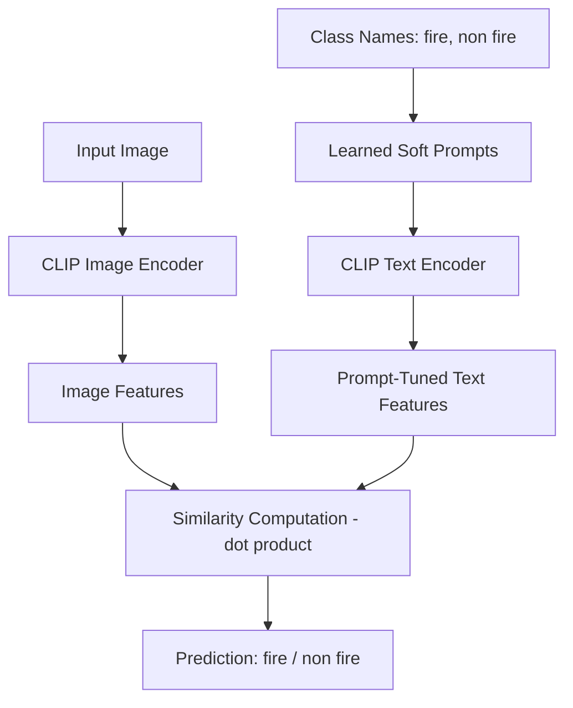

# 🔥 Fire Detection using CLIP + Prompt Tuning

This project fine-tunes **soft prompts** for [CLIP](https://github.com/mlfoundations/open_clip) (ViT-B-32) to detect **fire vs. non-fire** images.  
Instead of retraining the whole model, we **learn prompt embeddings** that better align with your dataset, making training efficient and accurate.

---

## 📂 Project Structure
``` bash
├── train_clip_fire.py # Train soft prompts on fire/non-fire images
├── predict_clip_fire.py # Run inference + save predictions
├── learned_prompts.pth # Saved trained soft prompts (after training)
├── fire_predictions.csv # Example output of predictions
├── Dataset/
│ ├── train/
│ │ ├── fire/
│ │ └── non_fire/
│ └── test/
│ │ ├── fire/
│ │ └── non_fire/
```
---

## ⚙️ How It Works

1. **Training (`train_clip_fire.py`)**
   - Loads CLIP (ViT-B-32) pretrained on 400M image–text pairs.
   - Initializes **learned prompt vectors** (random tensors).
   - Trains only the prompts (not the CLIP weights) to better separate **fire** vs **non fire**.
   - Uses **cross-entropy loss** with class balancing.
   - Saves prompts in `learned_prompts.pth`.

2. **Prediction (`predict_clip_fire.py`)**
   - Loads the trained soft prompts.
   - Encodes test images with CLIP.
   - Combines prompts + CLIP embeddings → computes similarity.
   - Outputs predictions + confidence scores into a CSV.
   - Prints a **classification report** (precision, recall, F1, accuracy).

---

## 🚀 Usage

### 1️⃣ Install dependencies
pip install torch torchvision pandas scikit-learn tqdm pillow open_clip_torch

### 2️⃣ Organize dataset
``` bash
Dataset/
├── train/
│   ├── fire/       # images with fire
│   └── non_fire/   # images without fire
└── test/
    ├── fire/
    └── non_fire/
```

### 3️⃣ Train prompts
python train_clip_fire.py

### 4️⃣ Run inference
python predict_clip_fire.py
Results will be saved to => fire_predictions.csv
+ Console output with accuracy & classification report

### 📊 Example Output
Classification Report:

              precision    recall  f1-score   support

        fire       1.00      1.00      1.00      7000
    non fire       1.00      0.99      0.99      3500
    
    accuracy                           1.00     10500
    macro avg      1.00      1.00      1.00     10500
    weighted avg   1.00      1.00      1.00     10500

Accuracy:
✅ Overall Accuracy: 0.9965

## 🧠 Key Concepts

. CLIP (Contrastive Language-Image Pretraining): Pretrained model linking images ↔ text.
. Prompt Tuning: Learn small trainable vectors (“soft prompts”) instead of retraining the full model.
. Cross-Entropy Loss: Encourages fire images to align with the “fire” prompt, and non-fire with “non fire”.
. Adam Optimizer: Updates prompt vectors based on gradients.

## 🎯 Why Prompt Tuning?

✅ Much faster than fine-tuning CLIP’s full weights.
✅ Requires fewer resources (only prompt vectors are trained).
✅ Retains CLIP’s general knowledge while adapting to fire detection.

## 🙌 Acknowledgements
- [OpenCLIP](https://github.com/mlfoundations/open_clip) for the pretrained CLIP models.  
- [Prompt Tuning: Unlocking the Potential of CLIP for Image-Text Matching](https://medium.com/@abhinavnagpal12/prompt-tuning-unlocking-the-potential-of-clip-for-image-text-matching-9dcc4772222b) — insightful article that helped in understanding and applying prompt tuning to this project.  

## 🏗️ Architecture Flow


